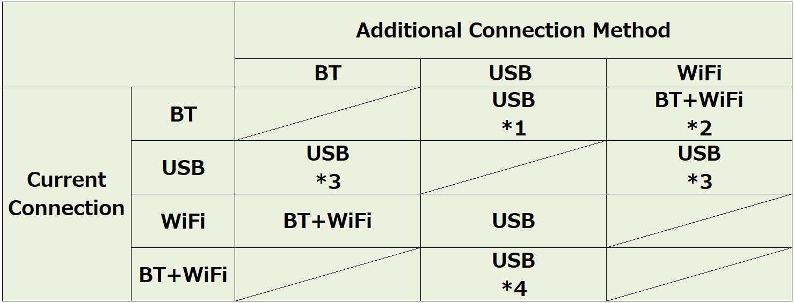

# 4.1. Switching Communication Paths

## 1. Overview
This chapter describes the priority rule and status notification to switch connections in case of the system connects a device via multiple paths.

## 2. Background/Purpose/Reason for Standardization
The proposal of switching from BT to USB on the same device, "SDL 00053 - Connectivity via iAP-BT and Transport Switch", has been accepted in the SDL Evolution in the SDL Consortium.
However, the switching from BT to USB is applicable only to the iOS system.
Since the behavior of switching communication paths is not explicitly defined in the SDL standard specification, it is necessary for the OEMs to define it by themselves.
Hence, the purpose of this document is to standardize such cases/issues using the TOYOTA specification, in order to be able to contribute to the SDL Ecosystem.

## 3. Function Details
### 3.1. Specification for Switching Communication Paths
These are the basic rules for specification of switching communication paths:
- The priority of communication methods: USB > BT
- If the SDL connects multiple terminals (mobiles), then the device that is already connected to the SDL is prioritized.

!!! NOTE

WiFi cannot communicate alone by itself, therefore WiFi is excepted from the priority.

!!!

Table 1 shows the specifications on how SDL connection path is switched when new comunication path is added during SDL connection.

**Table1.** Table for switching multiple Transport

!!! NOTE

 * 1 If the HMI recognized that current BT and new USB are connected to same device, SDL transport should be switched to USB.
 * 2 The SDL App that uses VPM detects WiFi transport when it is launched. If the WiFi transport that is connected to same device as BT connection is found, the SDL App will start VPM via WiFi.
 * 3 The USB connection path is prioritized, even if both paths are connected to the same device.
 * 4 If the SDL App recognized that current BT and new USB are connected to same device, SDL transport should be switched to USB.

!!!

### 3.2. Logic for switching communication paths in iOS
The process of switching communication path from BT to USB
 
1. When the switching of transport occurs, the SDL Core starts the timer by setting in timeout value in the configuration file. 
2. The HMI caches the HMI Level of current running SDL App. After the SDL App has switched the device, the HMI will perform the following process: 
      (a) Create the list of SDL Apps which is waiting for re-registering
      (b) Terminate the current BT Transport
      (c) Copy the current BT status to the USB device  
3. 
  (a) If the timer for switching transport expires, the HMI clears the list of SDL Apps which are waiting for the re-registering. Then, the SDL Core calls `Unregistered()` on the SDL Apps which are not registered within the switching time. Afterwards, the result is notified to the HMI from the SDL Core.
  (b) If the HMI has received the RegisterApp notification and SDL App is included in the list of re-registering before the process for switching transport times out, the HMI returns to the previous HMI Level of that SDL App. And then, the HMI notifies to the mobile that the SDL App was launched successfully.

## 4. Differences from SDL standard specification
The specification for switching communication paths is not explicitly defined in the SDLC Official documents.
Therefore, the contents described in Table1 above differ from the existing SDL standard specification.

## 5. Implementation Methods
The system has implemented the SDLC's "SDL 0053- Connectivity via iAP-BT and Transport Switch".

## 6. Impacted Platforms
There is no impact on any platforms.
