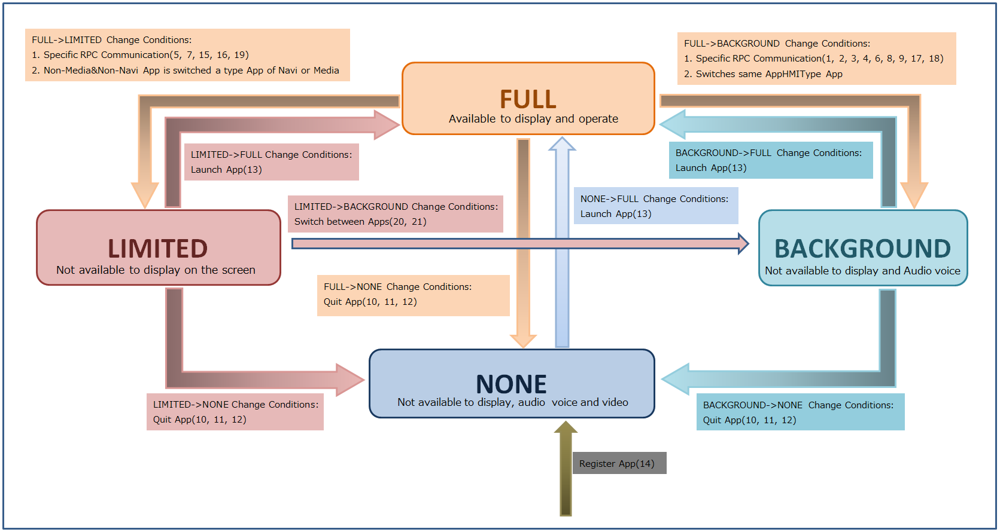

# 6. Behavior of each HMI Status

## 1. Overview
This chapter provides information about the definition of the HMI Status (Level) and the behavior of SDL Apps by HMI status.
The HU controls the status of display and playback audio by notifying the HMI Level to the mobile.

## 2. Background/Purpose/Reason for Standardization
It is difficult to grasp an overall understanding regarding the HMI Level, since the description of it is included in the related RPC description in the SDL official documents.
Therefore, there is a possibilty that differences may occur depending on the behavior of each HU.
Hence, the purpose of this document is to share information cultivated through the development of SDL compatible HU in Toyota, in order to be able to contribute to the SDL Ecosystem.

## 3. Function Details
### 3.1. Definition of HMI Level and Transition Rule
The definition of behavior and state of transition for each HMI Level are not described in the documents, and the logic is only written in the source code.
Therefore, the definition of behavior and state of transition of each HMI level are shown in the following tables.

**Table1.** Definition of each HMI Level

|
 HMI Level 
|
 Definition 
|
|:---:|:---|
|
 FULL 
|
An SDL App with this state is displayed on full screen. The SDL App can also operate interactively with other HMI modules(such as UI, VR, TT, Audio system, etc). 
|
|
 LIMITED 
|
A part of the function or display is limited (Currently, the "Limited" state is only applied to Navigation and Media Apps, for example, SDL App which AppHMIType is "NAVIGATION", "PROJECTION" and "MEDIA". 
|
|
 BACKGROUND 
|
The user has launched the SDL App once, but it is not currently displayed. SDL App in this state can send a part of RPC to the HMI that follows the Policy Table rule. 
|
|
 NONE 
|
The user has not launched the SDL App before, or the user has quit the SDL App. SDL App in this state cannot communicate with the HMI. 
|

**Table2.** Status Transition Rule of HMI Level

|
 Status Transition Rule 
|
|:---|
|
 If the SDL App HMI Level is "FULL", the behavior of other SDL Apps is as follows:   - All SDL Apps except SDL Media/Video App will be BACKGROUND.  - All SDL Media/Video Apps(such as NAVIGATION, VC, MEDIA and PROJECTION) will be LIMITED.  - SDL Apps which AppHMIType are same will be BACKGROUND. 
|
|
 If the SDL App HMI Level is "LIMITED", the behavior of other SDL Apps is as follows:   - All SDL Apps except SDL Media/Video Apps will keep the current status.  - SDL Apps which AppHMIType are different will keep the current status.  - SDL Apps which AppHMIType are same will be BACKGROUND. 
|
|
 If the SDL App HMI Level is "BACKGROUND", the behavior of other SDL Apps is as follows:   - All SDL Apps will keep the current status. 
|

### 3.2. Status Transition Diagram
In Figure1 below shows the diagram of status transition based on the current status transition rule.
Also, Table3 below shows the various status transition and the expected behavior related to various triggers.

|||
**Figure1.** Status Transition Diagram

|||

**Table3.** Various Status Transition and Expected behavior related to Various Trigger

###  3.3. Competition of Video Streaming/Audio Streaming
Other than the HMI level status, SDL has also a status for VideoStreaming/AudioStreaming which can be controlled.
The following tables below show the rules of status change, when the user switches SDL App; VideoStreaming in Table4 and AudioStreaming in Table5.

**Table4.** Matrix table of Video Stream status

*S : STREAMABLE, NS : NOT_STREAMABLE  

**Table5.** Matrix table for Audio Streaming status

*A : AUDIBLE, NA : NOT_AUDIBLE
