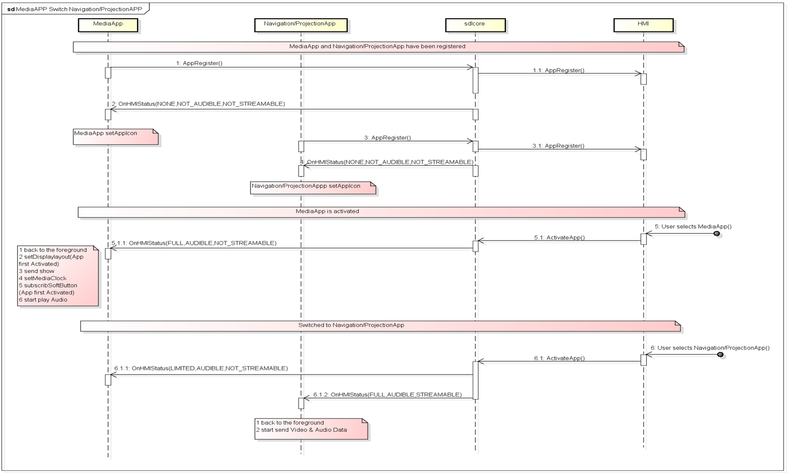
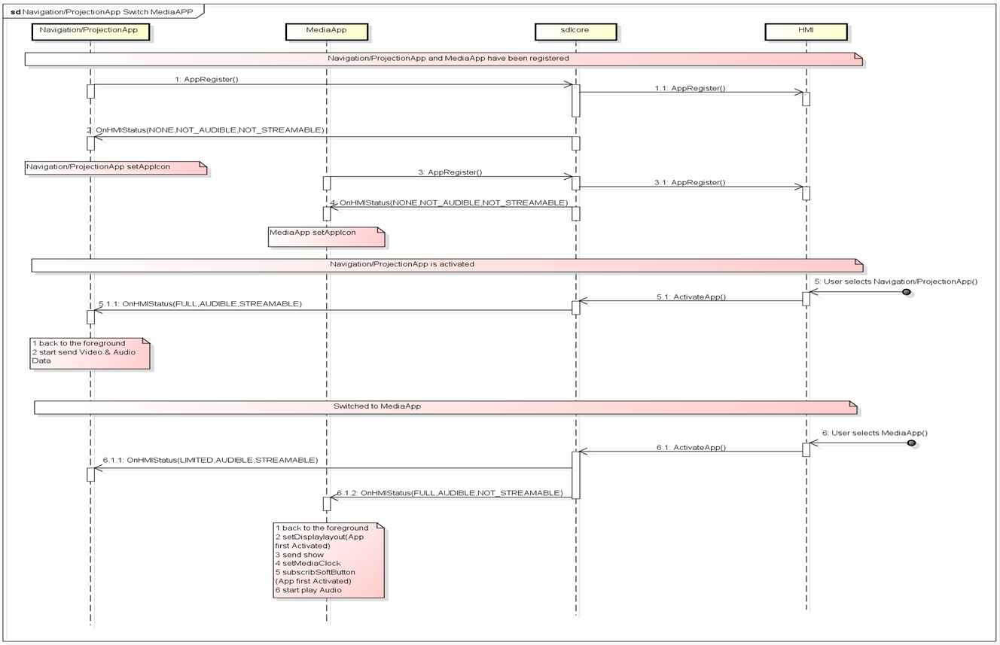
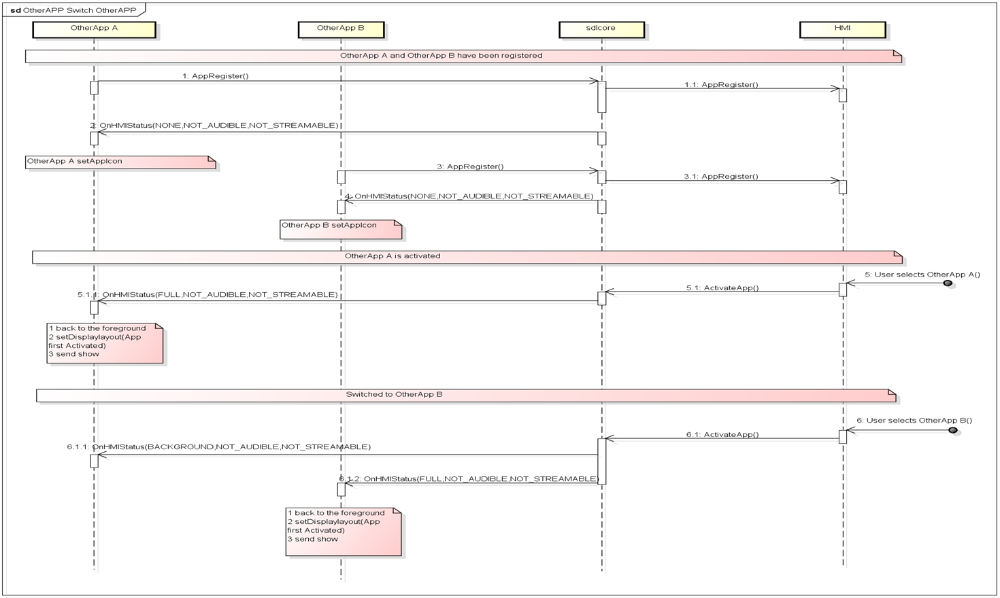

# 3. Switching SDL Apps

## 1. Overview
This chapter describes the sequence of switching SDL Apps.

In addition, regarding the behavior of "Pressing other SDL App Icon on the HU screen" and "The launch by pressing HardSW" please refer to the following:

<ol>
"2.1. Press the SDL App Icon on the SDL Menu screen" 
"2.2. Launch by  Voice Recognition" 
"2.3. Launch by choosing the Audio source on the Audio screen" 
"2.4. Launch by HardSW" 
</ol>

In this chapter, the overall sequence of switching SDL Apps for each type is described.

## 2. Background/Purpose/Reason for Standardization
Currently, switching to other SDL App while an (existing) SDL App is running, is an SDL standard behavior.
However, since the behavior of switching Apps is not explicitly defined in the SDL standard specification, it is necessary for the OEMs to define it by themselves.
Hence, the purpose of this document is to standardize such cases/issues using the TOYOTA specification, in order to be able to contribute to the SDL Ecosystem.

## 3. Function Details
### 3.1. Function overview
Table 1 shows the 9 patterns for switching SDL Apps.

**Table1.** Sequence pattern of switching SDL Apps
<table>
  <tr>
    <th align="center"> No. </th>
    <th align="center"> 1st Launched App	</th>
    <th align="center"> 2nd launched App </th>
  </tr>
  <tr>
    <td align="center"> 1 </td>
    <td align="left" rowspan="3"> "MEDIA" type SDL App </td>
    <td align="left"> "MEDIA" type SDL App </td>
  </tr>
  <tr>
    <td align="center"> 2 </td>
    <td align="left"> "NAVIGATION"/"PROJECTION" type SDL App </td>
  </tr>
  <tr>
    <td align="center"> 3 </td>
    <td align="left"> Normal type SDL App </td>
  </tr>
  <tr>
    <td align="center"> 4 </td>
    <td align="left" rowspan="3"> "NAVIGATION"/"PROJECTION" type SDL App </td>
    <td align="left"> "MEDIA" type SDL App </td>
  </tr>
  <tr>
    <td align="center"> 5 </td>
    <td align="left"> "NAVIGATION"/"PROJECTION" type SDL App </td>
  </tr>
  <tr>
    <td align="center"> 6 </td>
    <td align="left"> Normal type SDL App </td>
  </tr>
  <tr>
    <td align="center"> 7 </td>
    <td align="left" rowspan="3"> Normal type SDL App </td>
    <td align="left"> "MEDIA" type SDL App </td>
  </tr>
  <tr>
    <td align="center"> 8 </td>
    <td align="left"> "NAVIGATION"/"PROJECTION" type SDL App </td>
  </tr>
  <tr>
    <td align="center"> 9 </td>
    <td align="left"> Normal type SDL App </td>
  </tr>
</table>

App types are determined by 'AppHMIType' in Table2 :

**Table2.** AppType Categorized by each AppHMIType
<table>
  <tr>
    <th align="center"> App Type </th>
    <th align="center"> AppHMIType </th>
  </tr>
  <tr>
     <td align="left" rowspan="9"> Normal type App </td>
     <td align="left"> DEFAULT </td></tr>
  </tr>
  <tr>
     <td align="left"> COMMUNICATION </td></tr>
  </tr>
  <tr>
     <td align="left"> MESSAGING </td></tr>
  </tr>
  <tr>
     <td align="left"> INFORMATION </td></tr>
  </tr>
  <tr>
     <td align="left"> SOCIAL </td></tr>
  </tr>
  <tr>
     <td align="left"> BACKGROUND_PROCESS </td></tr>
  </tr>
  <tr>
     <td align="left"> TESTING </td></tr>
  </tr>
  <tr>
     <td align="left"> SYSTEM </td></tr>
  </tr>
  <tr>
     <td align="left"> REMOTE_CONTROL </td></tr>
  </tr>
  <tr>
     <td align="left"> MEDIA type App </td>
     <td align="left"> MEDIA </td></tr>
  </tr>
  <tr>
     <td align="left" rowspan = "2"> NAVIGATION / PROJECTION type App </td>
     <td align="left"> NAVIGATION </td></tr>
  </tr>
  <tr>
     <td align="left"> PROJECTION </td></tr>
  </tr>
</table>

## 4. Differences from SDL standard specification
There is no provided description about the sequences of switching between the SDL Apps in the SDL official documents.
Therefore, all of the following sequences  describe in "5. Sequence Diagrams" differ from the existing SDL standard specifications.

## 5. Sequence Diagrams
### 5.1. Switching from "MEDIA" type SDL App to "MEDIA" type SDL App

 
**Figure1.** Sequence of switching from "MEDIA" type SDL App to "MEDIA" type SDL App

### 5.2. Switching from "MEDIA" type SDL App to "NAVIGATION"/"PROJECTION" type SDL App

 
**Figure2.** Sequence of switching from "MEDIA" type SDL App to "NAVIGATION/PROJECTION" type SDL App

### 5.3. Switching from "MEDIA" type SDL App to Normal type SDL App

 
**Figure3.** Sequence of switching from "MEDIA" type SDL App to Normal type SDL App

### 5.4. Switching from "NAVIGATION"/"PROJECTION" type SDL App to "MEDIA" type SDL App

 
**Figure4.** Sequence of switching from "NAVIGATION/PROJECTION" type SDL App to "MEDIA" type SDL App

### 5.5. Switching from "NAVIGATION"/"PROJECTION" type SDL App to "NAVIGATION"/"PROJECTION" type SDL App

 
**Figure5.** Sequence of switching from "NAVIGATION/PROJECTION" type SDL App to "NAVIGATION/PROJECTION" type SDL App

### 5.6. Switching from "NAVIGATION"/"PROJECTION" type SDL App to Normal type SDL App

 
**Figure6.** Sequence of switching from "NAVIGATION/PROJECTION" type SDL App to Normal type SDL App

### 5.7. Switching from Normal type SDL App to "MEDIA" type SDL App

 
**Figure7.** Sequence of switching from Normal type SDL App to "MEDIA" type SDL App

### 5.8. Switching from Normal SDL App to "NAVIGATION"/"PROJECTION" type SDL App

 
**Figure8.** Sequence of switching from Normal type SDL App to "NAVIGATION/PROJECTION" type SDL App

### 5.9. Switching from Normal type SDL App to Normal type SDL App

 
**Figure9.** Sequence of switching from Normal type SDL App to Normal type SDL App

## 6. Impacted Platforms
Changes impact the following platform/s:
- HMI
